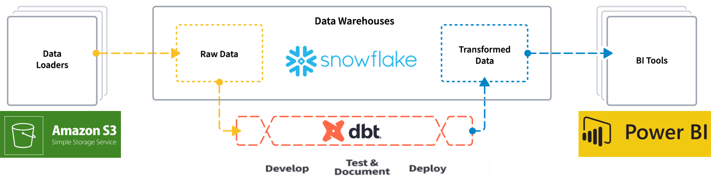
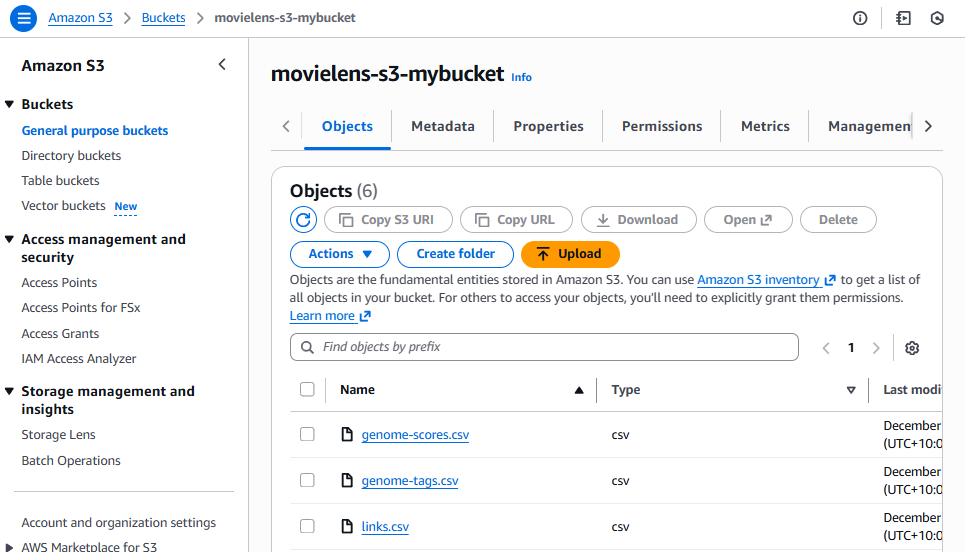
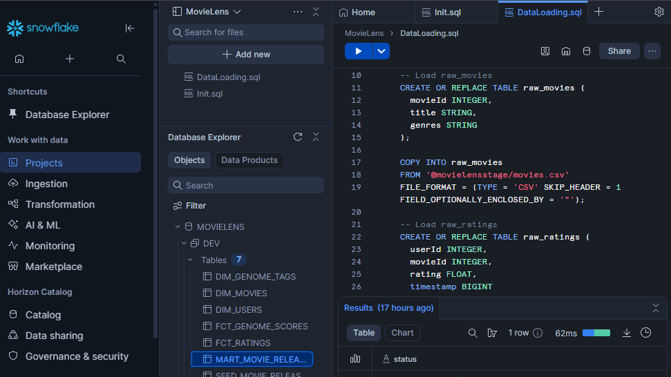
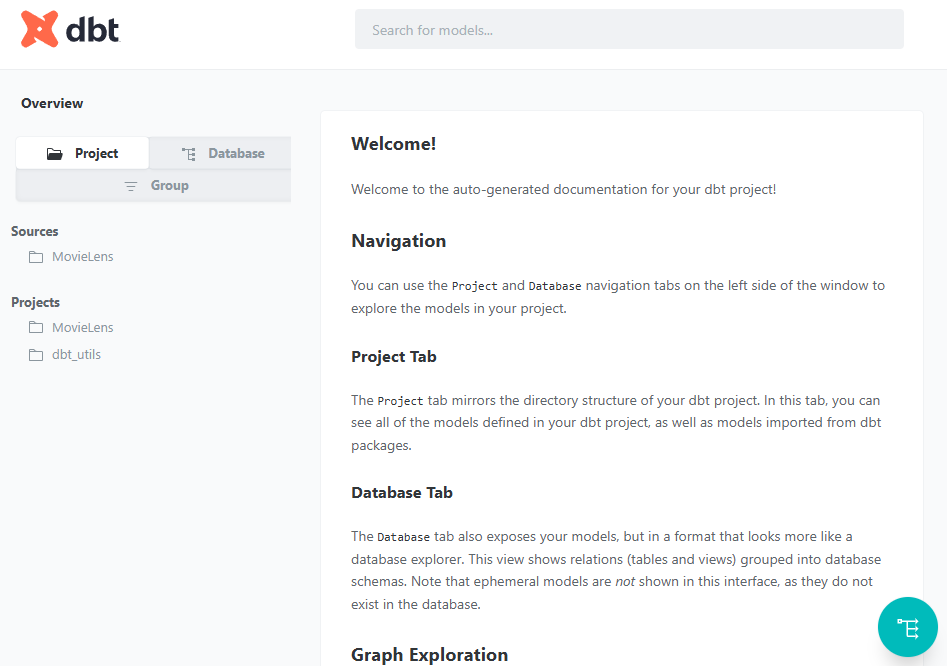
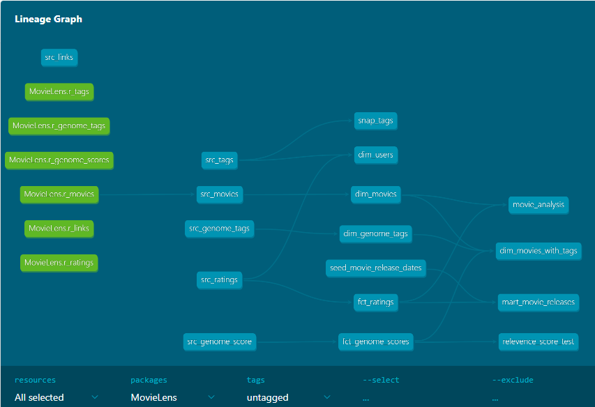

# 🎬 MovieLens Project

## 🚀 Project Overview
Throughout my studies and early projects, I often worked with static datasets, loading them into tools, performing analysis, and creating visualizations. But I started asking myself: What happens if the data changes constantly? How do I update my analysis efficiently without overwrite raw data? What if the dataset scales to millions of records?*  
This project was my answer. Using the MovieLens dataset, I built a full ELT workflow with AWS S3, Snowflake, and dbt to simulate a production-grade data pipeline. My goal was not just to clean and analyze data, but to design a system that can handle updates, track historical changes, and scale reliably.  
By implementing incremental models, snapshots, testing frameworks, and automated documentation, I gained hands-on experience in transforming raw, messy data into analytics-ready models.

Special thanks to [Darshil Parmar's tutorial](https://www.youtube.com/watch?v=zZVQluYDwYY&t=359s) for guidance on building this amazing project.

---

## 💡 Core Concepts
- **ELT Workflow:** Transformation happens inside the warehouse after loading, making the process faster and cost-efficient. 
- **Modularity & Reusability:** dbt models and macros allow complex logic to be broken down and reused across models.  
- **Materializations & SCDs:** Models use dbt materializations to support **Slowly Changing Dimensions (SCDs)**, including incremental which updates existing records while preserving historical data. Snapshots are used to track changes over time for mutable tables.
- **Data Quality:** Tests and source definitions ensure accuracy and consistency of analytics-ready tables.  
- **Documentation & Transparency:** dbt generates lineage graphs and documentation to make pipelines understandable and maintainable.

---

## 🛠 Setup & Workflow

1. **Local Environment**
   - Create a Python virtual environment and activate it, together with git setup.
   - Initialize the dbt project in VS Code and install recommended formatting extensions.

2. **Data Ingestion**
   - Download the [MovieLens 20M dataset](https://grouplens.org/datasets/movielens/20m/).  
   - Upload raw CSVs to an AWS S3 bucket.
   - Create an IAM user in AWS with access key for data loading.  

3. **Data Warehouse Connection**
   - Set up Snowflake as the target warehouse.  
   - Generate profile to allow dbt to connect to Snowflake.  

---

## 📊 Usage

| Action | dbt Command | Description |
|--------|------------|-------------|
| ▶️ Run Models | `dbt run` | Executes transformations; outputs to DEV schema |
| 🧪 Test Data Quality | `dbt test` | Runs defined tests |
| 📥 Load Static Data | `dbt seed` | Loads reference CSVs (constants, time, city, zip codes) |
| 🕰 Track History | `dbt snapshot` | Tracks mutable table states over time |
| 📦 Fetch Packages | `dbt deps` | Fetches external dbt packages |
| 📄 Generate Docs | `dbt docs generate` | Creates project documentation |
| 🌐 Serve Docs | `dbt docs serve` | Hosts docs locally |
| 📝 Compile SQL | `dbt compile` | Converts dbt/Jinja SQL into raw SQL |

## 📖 Notes & Reflections

- **Meeting Enterprise & Business Needs:** This pipeline demonstrates how to handle large, changing datasets in a way that supports enterprise-level analytics. It ensures that organizations can trust, scale, and act on their data efficiently.  
- **Development Workflow:** New models are directed to a DEV schema while RAW data remains untouched. This ensures **safety, reproducibility, and easy rollback** if transformations need adjustment.  
- **Realistic Data Handling:** Using incremental models, snapshots, and materializations shows how to manage updates while preserving historical data, reflecting real-world operational requirements.  
- **Code Style & Organization:** SQL files follow dbt best practices, leveraging Jinja templates for modularity, reusability, and maintainability.  
- **ELT Approach:** Transforming data inside the warehouse highlights the advantages of ELT over traditional ETL, such as faster processing, scalability, and reduced data movement.

---

## 📸 Illustration
Project overview

AWS S3 bucket storage

Snowflake platform

dbt Auto-generated Document

dbt Intuitive Lineage Graph

